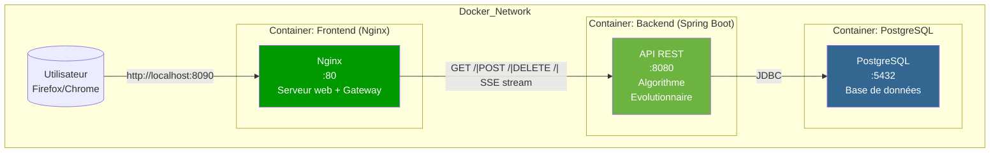

# TSP - Algorithme Évolutionnaire

[](https://docs.docker.com/compose/)
[](https://angular.io/)
[](https://spring.io/projects/spring-boot)
[](https://www.postgresql.org/)
[](https://opensource.org/licenses/MIT)

> Resolution du probleme du voyageur de commerce (TSP) grace a un algorithme evolutionnaire.

## Description

Ce projet implmente une solution au **Probleme du Voyageur de Commerce (TSP - Traveling Salesman Problem)** en utilisant un **algorithme evolutionnaire**. L'application web permet aux utilisateurs d'ajouter des villes avec leurs coordonnees et de trouver le chemin optimal qui passe par toutes les villes une seule fois et revient au point de depart.

### Le Probleme du Voyageur de Commerce

Le TSP est un probleme d'optimisation combinatoire classique :
- **Objectif** : Trouver le chemin le plus court qui passe par toutes les villes exactement une fois
- **Complexite** : NP-difficile (pas de solution polynomiale connue)
- **Application** : Logistique, planification de tournees, circuits electroniques

## Architecture



### Le frontend comme gateway (anti-CORS)

Le container **frontend** (Nginx) joue un double rôle :
1. **Serveur web** : Sert les fichiers statiques Angular (HTML, JS, CSS)
2. **Gateway API** : Proxie toutes les requêtes `/api` vers le backend

Cette architecture permet d'**éviter les problèmes CORS** car :
- Le navigateur émet toutes les requêtes vers le même domaine (`localhost:8090`)
- Nginx转发 (/api/*) vers le backend en interne
- Plus besoin de configurer `@CrossOrigin` ou d'en-têtes CORS complexes

```
┌─────────────┐    /api/*    ┌──────────────┐    JDBC    ┌────────────┐
│ Navigateur  │ ──────────► │   Nginx      │ ─────────►│  Backend  │
│             │ ◄────────── │ (Proxy)      │ ◄─────────│  (Spring) │
└─────────────┘             └──────────────┘           └────────────┘
```

```
tsp-evolutionary/
├── docker-compose.yml
├── README.md
├── backend/
│   ├── src/main/java/com/tspevo/
│   │   ├── TspEvolutionaryApplication.java
│   │   ├── controller/TspController.java
│   │   ├── service/
│   │   │   ├── TspService.java
│   │   │   └── EvolutionaryAlgorithm.java
│   │   ├── model/
│   │   │   ├── City.java
│   │   │   └── TspResult.java
│   │   └── repository/CityRepository.java
│   ├── Dockerfile
│   └── pom.xml
└── frontend/
    ├── src/app/
    │   ├── app.component.ts
    │   ├── app.component.html
    │   ├── app.config.ts
    │   ├── service/tsp.service.ts
    │   └── model/city.ts
    ├── nginx.conf
    ├── Dockerfile
    └── package.json
```

## Stack Technique

| Composant | Technologie | Version |
|-----------|-------------|---------|
| Frontend | Angular | 17+ |
| Backend | Spring Boot | 3.2.0 |
| Base de donnees | PostgreSQL | 15 |
| Runtime Java | Eclipse Temurin | 17 |
| Serveur HTTP | Nginx | Alpine |
| Containerisation | Docker | latest |
| Orchestration | Docker Compose | v3.8 |

## Algorithme Evolutionnaire

### Principe

L'algorithme evolutionnaire s'inspire de la theorie de l'evolution naturelle pour trouver des solutions optimales :

1. **Population initiale** : Generation aleatoire de routes candidates
2. **Evaluation** : Calcul de la distance totale de chaque route
3. **Selection** : Choix des meilleurs individus (tournoi)
4. **Croisement (Crossover)** : Combinaison de deux routes parents
5. **Mutation** : Alteration aleatoire d'une route
6. **Survie** : Selection des meilleurs individus pour la prochaine generation

### Parametres par Defaut

| Parametre | Valeur | Description |
|-----------|--------|-------------|
| Taille de population | 100 | Nombre d'individus par generation |
| Generations max | 500 | Critere d'arret |
| Taux de mutation | 2% | Probabilite de mutation |
| Taux de crossover | 80% | Probabilite de croisement |
| Taille du tournoi | 5 | Nombre de participants par selection |

### Operateurs Genetiques

- **Selection** : Tournoi binaire (les deux meilleurs sur 5)
- **Crossover** : Partially Mapped Crossover (PMX)
- **Mutation** : Echange de deux villes (swap)

## Installation et Lancement

### Prerequisites

- [Docker](https://www.docker.com/get-started) (version 20.10+)
- [Docker Compose](https://docs.docker.com/compose/install/) (version 2.0+)

### Etapes

1. **Cloner le projet** :
   ```bash
   git clone <repository-url>
   cd tsp-evolutionary
   ```

2. **Lancer l'application** :
   ```bash
   # Mode interactif (voir les logs)
   docker-compose up --build
   
   # Ou en arriere-plan
   docker-compose up -d --build
   ```

3. **Acceder a l'application** :
   - Frontend : http://localhost:8090
   - API Backend : http://localhost:8090/api
   - Base de donnees : localhost:5432

### Commandes Utiles

```bash
# Arreter les containers
docker-compose down

# Recrer les containers
docker-compose up -d --build --force-recreate

# Voir les logs
docker-compose logs -f

# Voir les logs d'un service specifique
docker-compose logs -f backend
docker-compose logs -f frontend
docker-compose logs -f postgres
```

## API REST

### Endpoints

| Methode | Endpoint | Description | Corps |
|---------|----------|-------------|-------|
| POST | `/api/cities` | Ajouter une ville | `{"name": "Paris", "x": 10, "y": 20}` |
| GET | `/api/cities` | Liste des villes | - |
| DELETE | `/api/cities` | Supprimer toutes les villes | - |
| POST | `/api/tsp/optimize` | Lancer l'optimisation | - |

### Exemples de Requetes

**Ajouter une ville** :
```bash
curl -X POST http://localhost:8090/api/cities \
  -H "Content-Type: application/json" \
  -d '{"name": "Paris", "x": 10, "y": 20}'
```

**Liste des villes** :
```bash
curl http://localhost:8090/api/cities
```

**Lancer l'optimisation** :
```bash
curl -X POST http://localhost:8090/api/tsp/optimize
```

**Reponse d'optimisation** :
```json
{
  "optimalRoute": [
    {"id": 1, "name": "Paris", "x": 10, "y": 20},
    {"id": 3, "name": "Lyon", "x": 30, "y": 40},
    {"id": 2, "name": "Marseille", "x": 50, "y": 60}
  ],
  "totalDistance": 156.32,
  "generations": 127,
  "executionTimeMs": 234
}
```

## Utilisation de l'Interface

1. **Ajouter des villes** :
   - Remplissez le formulaire avec le nom de la ville
   - Entrez les coordonnees X et Y
   - Cliquez sur "Ajouter"

2. **Ajouter plusieurs villes** :
   - Repetez l'etape precedente pour chaque ville
   - Au minimum 2 villes necessaires pour l'optimisation

3. **Lancer l'optimisation** :
   - Cliquez sur "Optimiser le trajet"
   - Attendons que l'algorithme trouve la solution optimale

4. **Visualiser le resultat** :
   - Distance totale optimale
   - Nombre de generations utilisees
   - Temps d'execution
   - Ordre optimal des villes

## Configuration

### Variables d'Environnement

**Backend** (`docker-compose.yml`) :
```yaml
environment:
  - SPRING_DATASOURCE_URL=jdbc:postgresql://postgres:5432/tspdb
  - SPRING_DATASOURCE_USERNAME=tspuser
  - SPRING_DATASOURCE_PASSWORD=tsppass
```

**PostgreSQL** :
```yaml
environment:
  - POSTGRES_DB=tspdb
  - POSTGRES_USER=tspuser
  - POSTGRES_PASSWORD=tsppass
```

### Ports

| Service | Port |
|---------|------|
| Frontend (Nginx) | 8090 |
| Backend (Spring Boot) | 8091 |
| PostgreSQL | 5432 |

## Developpement

### Structure du Projet

Le projet est organise en deux parties distinctes :

- **Backend** : Application Spring Boot avec algorithme evolutionnaire
- **Frontend** : Application Angular avec interface utilisateur

### Construction Manuelle

**Backend** :
```bash
cd backend
mvn clean package
docker build -t tsp-backend .
```

**Frontend** :
```bash
cd frontend
npm install
npm run build
docker build -t tsp-frontend .
```

## Licence

Ce projet est sous licence MIT.

## Contribution

Les contributions sont les bienvenues ! N'hesitez pas a ouvrir une issue ou a soumettre une pull request.

---

Developpe avec Angular, Spring Boot et PostgreSQL
